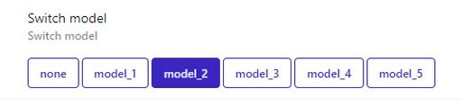

# <a id="Top">Tuya Switch Module 1 gang with custom firmware</a>

### Custom firmware for Tuya Switch models

# TODO:

### Device Model

| Custom Model | Zigbee Model | Z2M Model | Manufacturer     | Update method |
|--------------|--------------|-----------|------------------|---------------|
| model_1      | TS0001       |  [JR-ZDS01](https://www.zigbee2mqtt.io/devices/JR-ZDS01.html) | _TZ3000_6axxqqi2 | [OTA file](bin/1141-d3a3-1111114b-tuya_mini_switch_s1_zrd_model1.zigbee)      |
| model_2      | ZG-301Z      |  [ZG-301Z](https://www.zigbee2mqtt.io/devices/ZG-301Z.html)  | HOBEIAN          | [BIN file](bin/tuya_mini_switch_s1_zrd_model2_last_version.bin)      |

[Наверх](#Top)

