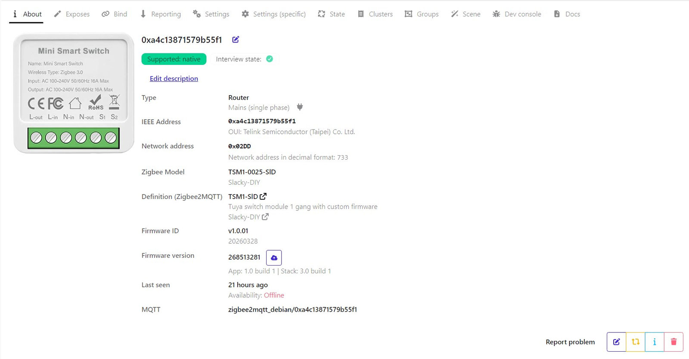

# <a id="Top">Tuya Switch Module 1 gang with custom firmware</a>

---

---

---

---

| Custom Model | Zigbee Model | Z2M Model | Zigbee Manufacturer| Manufacturer | Update method | Description |
|:------------:|:------------:|:---------:|:------------------:|:------------:|:-------------:|:-----------:|
| model_1 | TS0001 | [JR-ZDS01](https://www.zigbee2mqtt.io/devices/JR-ZDS01.html) | _TZ3000_6axxqqi2 | [Girier](https://www.zigbee2mqtt.io/supported-devices/#v=Girier) | [OTA file](bin/1141-d3a3-1111114b-tuya_mini_switch_s1_zrd_model1.zigbee)      |  |
| model_2 | ZG-301Z | [ZG-301Z](https://www.zigbee2mqtt.io/devices/ZG-301Z.html) | HOBEIAN | [HOBEIAN](https://www.zigbee2mqtt.io/supported-devices/#v=HOBEIAN) | [BIN file](bin/tuya_mini_switch_s1_zrd_model2_last_version.bin) |  |
| model_3 (mini) | ZG-301Z | [ZG-301Z](https://www.zigbee2mqtt.io/devices/ZG-301Z.html) | HOBEIAN | [HOBEIAN](https://www.zigbee2mqtt.io/supported-devices/#v=HOBEIAN) | [BIN file](bin/tuya_mini_switch_s1_zrd_model3_last_version.bin) |  |

[Наверх](#Top)

